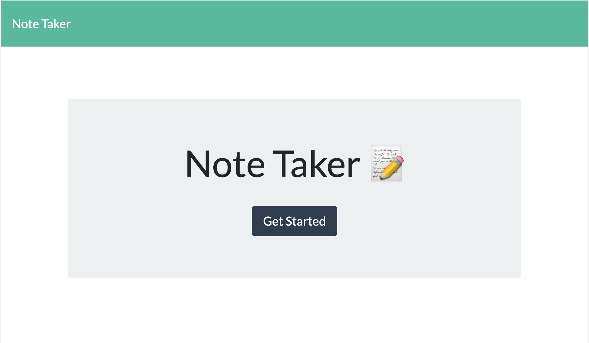
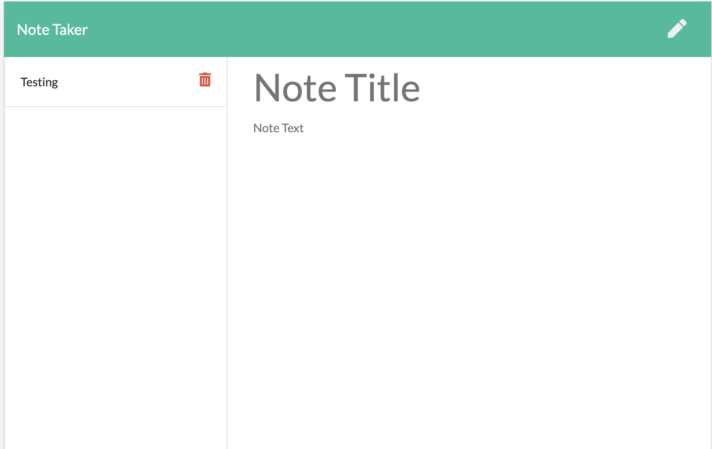

# noteTakerHW11

## Table of Contents: 
[Project Description](#Project-Description)  
[Installation](#Installation)  
[Usage Information](#Usage-Information)  
[Contribution Guidelines](#Contribution-Guidelines)  
[Test Instructions](#Test-Instructions)  
[Licensing](#Licensing)  
[Questions and Contact Information](#Questions-and-Contact-Information)  

## Project Description 
This homework is a notw taker app that allows users to store notes on their website using a local host. Their notes are saved on the database. They can add notes, delete notes, and view past notes.

## Usage Information 
Please host this app on your local 8080 server and run it on your browser.

### Questions and Contact Information 
Github: github.com/Alexgoldman98  
Github username: Alexgoldman98   
Email address: alexgoldman98@gmail.com  
Any Questions should be directed to me using the above contact information.

### Screenshots

### Heroku
https://notetakerhw11alexgoldman.herokuapp.com/